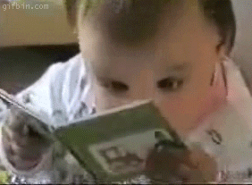

class: middle center 

```{r xaringan-themer, include=FALSE, warning=FALSE}
library(xaringanthemer) # Custom 'xaringan' CSS Themes 
style_duo_accent(
  colors = c(
    red = "red",
    purple = "#3e2f5b",
    lightpurple = "#DCD0FF",
    lavender = "#967bb6",
    violet = "#8A2BE2",
    periwinkle = "#ccccff",
    orange = "#FF5733", # Orange - Innovation and Excitement
    green = "#136f63", # Teal - Creativity and Growth
    white = "#FFFFFF",
    yellow = "yellow", # Yellow - Optimism and Energy:
    gold = "gold",
    turquoise = "#00C5CD", # Turquoise - Balance and Clarity:
    aquamarine = "#7FFFD4",
    teal = "#2c8475",
    darkgreen = "#006400",
    forestgreen = "forestgreen",
    firebrick = "firebrick",
    lightcoral = "lightcoral",
    black = "black",
    charcoal = "#36454F",
    purple = "#7030A0", # Purple (#7030A0) - Imagination and Open-mindedness
    blue = "#0070C0", #Blue - Persuasion and Trust:
    cornflowerblue = "cornflowerblue",
    deepskyblue = "deepskyblue",
    dodgerblue = "dodgerblue",
    steelblue = "steelblue",
    royalblue = "royalblue"),
  primary_color = "darkslategray",  
  secondary_color = "ivory",
  black_color = "#000004",
  white_color = "ivory",
  base_font_size = "20px",
  text_font_family = "Jost",
  text_font_url = "https://indestructibletype.com/fonts/Jost.css",
  header_font_google = google_font("Josefin Sans", "400", "400i", "600i", "700"),
 # header_font_google = google_font("Roboto Slab", "400", "700"),
  header_font_weight = "400",
  inverse_background_color = "black",
  # inverse_header_color = "#eaeaea",
  inverse_header_color = "#FFFFFF",
  title_slide_text_color = "#FFFFFF",
  text_slide_number_color = "#FFFFFF",
  text_bold_color = "#FF5733",
  code_inline_color = "turquoise",
  code_highlight_color = "transparent",
  link_color = "lightcoral",
  text_color = "ivory",
  header_color = "ivory",
  background_color = "darkslategray",
  blockquote_left_border_color = "steelblue",
  # table_row_even_background_color = lighten_color("white", 0.9),
  extra_fonts = list(
    "https://indestructibletype.com/fonts/Jost.css",
    google_font("Amatic SC", "400")
  )
)


```


```{r LIBRARIES, echo=FALSE, include=FALSE, warning=FALSE}
####
library(ggplot2) 
library(tibble) 
library(tidyr) 
library(readr) 
library(purrr) 
library(dplyr) 
library(stringr) 
library(forcats) 
library(lubridate) 
####
library(xaringan) 
library(xaringanExtra) 
library(xaringanthemer) 
library(countdown) 
library(htmltools) 
library(htmlwidgets) 
library(here) 
library(knitr) 
library(kableExtra) 
library(DT) 
library(shrtcts) 
library(xaringanmediacalls)
library(renderthis)
```

```{r xaringanExtra, echo = FALSE, warning = FALSE}
xaringanExtra::use_animate_css()
xaringanExtra::use_animate_all("fade")
xaringanExtra::use_clipboard()
xaringanExtra::use_editable(expires = 1)
xaringanExtra::use_extra_styles()
xaringanExtra::use_fit_screen()
xaringanExtra::use_freezeframe()
xaringanExtra::use_panelset()
xaringanExtra::use_progress_bar()
xaringanExtra::use_scribble()
xaringanExtra::use_search()
xaringanExtra::use_share_again()
# xaringanExtra::use_slide_tone()  # not yet a feature I like
xaringanExtra::use_tile_view()
xaringanExtra::use_webcam()
xaringanExtra::use_tachyons()

```

```{r xaringanExtra-freezeframe, echo=FALSE}
xaringanExtra::use_banner(
  top_left = "Top Left Banner",
  top_right = "Top Right Banner",
  bottom_left = "bit.ly/my-awesome-talk",
  exclude = "title-slide",
xaringanExtra::style_banner(
    text_color = NULL,
    background_color = NULL,
    padding_horizontal = NULL,
    padding_vertical = NULL,
    height = NULL,
    width = NULL,
    font_size = NULL,
    font_family = NULL,
    z_index = NULL,
    selector = NULL
  )
)
```

```{r xarington Countdown WHEN YOU NEED ONE, echo=FALSE}
# countdown::countdown(
#           minutes = 0,
#           seconds = 90,
#           warn_when = 5
#           style = "position: relative; width: min-content; margin: 1em auto;",
#           top = 0, bottom = 0,
#           left = 0, right = 0,
#           margin = "5%",
#           font_size = "8em",
#           color_running_background = "#31b09e",
#           color_warning_background = "#f79334",
#           color_finished_background = "#b56b6f",
#           color_finished_text = "#eaeaea"
#           # Fanfare when it's over
#           play_sound = TRUE
#
```

```{r setup, include=FALSE}
options(htmltools.dir.version = FALSE, htmltools.preserve.raw = FALSE)
knitr::opts_chunk$set(echo = FALSE)

```


<span style="font-style: avenir; font-size: 80px; font-weight: 400;">.char[Business Workshops and Consulting]</span>
<br>

.b[by]


.f1[.gold[Dan Swart,] .i.o[Business Developer]]


 "Practical Advice ~ Exceptional Results"]

---
class: middle center

.f-4.b--gold.ba.bw2.br4.shadow-5.ph4["Help comes from the outside...
by invitation."

.right[.f3[-- W. Edwards Deming]]
.right.f3.i[(father of the Japanese economic miracle)]

]


---
class: 

.left[About me:]
.gold[Dan Swart, .i.o[Business Developer]]


.left-column[


]

.right-column.pa0[

.pl3.absolute.top-7[I want you to be .char[successful] and gain .char[financial security].  You can do that if you make your company more .char[Effective], .o[Capable,] and .gold[Unique.] 

.pr3[If you're willing to .b.gold[try new things] you can turn your hard work into .char[prosperity] for yourself and others and live a .center.char[better life.]
]
]
]

---
class: top 

# How to contact me:

<br>

.center.f1[`r fontawesome::fa("phone")` (916) 802-1040]  


.center.f1[`r fontawesome::fa("envelope", a11y = "sem")` dan@danswart.com]

---
class: top 

# Today's workshop is brought to you by the letters .f-5.b.char['C'] and .f-5.b.char['A']

.pull-left[

.f-4.gold[COMPETITIVE]
.f-4.o[ADVANTAGE!]
]

.pull-right[


]

---
class: middle center     

<span style="font-size: 100px; font-weight: 400;">.char[Which is the Point!]</span>


---
class: left middle 

.f-6[# WHY ARE WE HERE?]

---
class: middle 

.pull-left[

.f-5.char[To]  
<span style="font-size: 120px;">**LEARN**</span>

]

.pull-right[



]

---
class: 

.pull-left[

.f1.char[
to have <span style="font-size: 140px;">**FUN**</span>]


]

.pull-right[


]

---
class: 

.pull-right[
<br>
<br>

.f1.char[And, to] 

<span style="font-size: 65px;">**MAKE A DIFFERENCE!**</span>
]

.pull-left.absolute.left-2.top-2[


]
---
class: 

.f1.center[.gold[101] failed startups described these<br>
.f1.red[Failure Points]]

--

.w-43[

+ 42% - no market need for their services or products
{{content}}

]

--
 
+ 29% - they ran out of cash<br>
{{content}}

--

+ 23% - didn’t have the right team running the business
{{content}}

--

+	19% - they were outcompeted
{{content}}


---
class: 

.f1.red[Failure Points ]  (cont)]


.w-43[

+ 18% - pricing and cost issues<br>
{{content}}

]

--

+ 17% - poor product offering
{{content}}

--

+ 14% - poor marketing
{{content}}

--

+ 14% - ignored their customers
{{content}}

---
class: bg-purple middle center     

<span style="font-size: 100px; font-weight: 400;">My workshops are designed specifically to help you .char[avoid] each of these .red[failure points]</span>

---
class: bg-purple middle center     

<span style="font-size: 100px; font-weight: 400;">So you can .b.char[succeed] and .b.aq[make a difference] in this world</span>

---
class: middle center 

.f-4.b--gold.ba.bw2.br4.shadow-5.ph4[
It .char['PAYS']<br> to .gold[LEARN AND APPLY] the material in this workshop

]

---
class: top 

<br>
.f1.center[Avoiding those .b.red[Failure Points]....i[and]]

--

*  Eliminate the .red[heavy losses] from clients who are .red[mismatched] with your company (80/20 rule)<br>

--

* Gain .char[economies of flow] as your system of value delivery improves<br>

--

* As .char[Quality] improves, your costs will go .gold[DOWN]

---
class: top 

<br>
* .char[Eliminate losses] from .red['strategy hopping'].  It compromises your brand and confuses the marketplace.<br>

--

* Gain .aq[competitive advantage] as you become ever more .char[Effective,] .o[Capable,] and .gold[Unique.]<br>

--

* Become a company that employees and suppliers .f1.char[want] to work with.

---
class: middle 

.f1.center[Customer loyalty increases as you become ever more .char[Effective], .o[Capable,] and .f1.gold[Unique.] ]

---
class: middle center 

.f1.b--gold.ba.bw2.br4.shadow-5.ph4[
Those are just some of the ways<br> it can .char['PAY']<br> to .gold[LEARN AND APPLY] this material

]

---
class: middle 

# .center[An Introduction to...]

---
class: 

These decisions will .gold[guide you] in every area...

.gold[Products and services]

--

Customer, employee and supplier relationships

--

.gold[Marketing and advertising]

--

Client attraction, selection and retention

--

.gold[Leadership and constancy of purpose]

--

Employee attraction, training and retention

---
class: top center 

<span style="font-size: 100px; font-weight: 400;">SAMPLE MAJOR HEADING</span><br><br><br><br><br><br>

.f-4.gold[sample] .f-5.char[sample]<br><br><br>


---
class: bg-teal top center

.f-6[Bonus Material]<br><br><br><br><br><br>

.f1[Build a .b.y[GREAT] 'Elevator Speech' from your Business Purpose]<br><br><br><br>

---
class:

# Answer these 5 questions:

--

.dsb[1 - Who are you?]

--

.o[2 - What do you do?]

--

.tq[3 - Who do you do it for?]

--

.gold[4 - So they can?]

--

.char[5 - How do they change as a result?]

---
class:

<br>
# An elevator speech...

.pt3.gold["I show entrepreneurs how they can live a better life."]

--

"Oh, Really!? &nbsp;&nbsp;&nbsp;&nbsp;.i.o[How do you do that?"]

--

.o["I teach] them .o[how to take their company to the next level] so they can .gold[turn their hard work into prosperity] for themselves and others and .char[live a better life."]

---
class:

# Which follows if your answers were:

--

.pull-left[
.f3.dsb[1 - Who are you?]  "Dan Swart"

.f3.o[2 - What do you do?] “I teach people how to take their company to the next level…”

.f3.tq[3 - Who do you do it for?]  “entrepreneurs…”
]

--

.pull-right[
.f3.gold[4 - So they can?] “turn their hard work into prosperity for themselves and others…”

.f3.char[5 - How do they change as a result?] “live a better life.”
]

---
class:

I'm Here to Help and Support You

For more information, or assistance, please contact me at:
dan@danswart.com
(916) 451-1040


I provide:

Effective financial management plans and training.

Process improvement plans and training.

---
class: top center 

.f1.gold[Porter's Competitive Strategy<br> Matrix]

.i[(Who Are Your Competitors?)]

|.tc[.b.red[&nbsp;(Industry-Wide)&nbsp;]<br> .f1.b.violet[&nbsp;Cost Leaders&nbsp;]] |.tc[.b.red[&nbsp;(Industry-Wide)&nbsp;]<br> .f1.b.darkgreen[&nbsp;Differentiators&nbsp;]]
|:---------------------:|:----------------------:|
|  |  |
|.tc[.b.red[&nbsp;(Niche Market)&nbsp;]<br> .f1.b.violet[&nbsp;Cost Leaders&nbsp;]  |.tc[.b.red[&nbsp;(Niche Market)&nbsp;]<br> .f1.b.darkgreen[&nbsp;Differentiators&nbsp;]|
| | |

---
class:

# It can .char[PAY] .o[(big time)] to focus on these three words...
.f1[.b.gold[Purpose]]

.f1[.b.gold[&nbsp;&nbsp;&nbsp;&nbsp;&nbsp;&nbsp;&nbsp;&nbsp;&nbsp;&nbsp;&nbsp;&nbsp;&nbsp;&nbsp;&nbsp;&nbsp;&nbsp;&nbsp;&nbsp;&nbsp;&nbsp;&nbsp;&nbsp;Value]]

.f1.right[.b.gold[Marketplace]]

---
class:
background-image: url(gif/thank-you-boy-hugs-chicken.gif)
background-size: contain


.f-5.b.right.o[THANK YOU!]


<br>
.f-5.left.b.char[.left[Q]
.left[&] 
.left[A]
]

---
class:  middle center

<span style="font-size: 80px; font-weight: 400;">.char[Business Workshops and Consulting]</span>

.b[by]

.gold[Dan Swart,] .i.o[Company Developer]

"Practical Advice ~ Exceptional Results"

.y[`(updated: `r Sys.Date()`)`]

---

<!-- GIT FILES -->

<!-- .gitignore file contents = -->

<!-- # History files -->
<!-- .Rhistory -->
<!-- .Rapp.history -->

<!-- # Session Data files -->
<!-- .RData -->
<!-- .RDataTmp -->

<!-- # User-specific files -->
<!-- .Ruserdata -->
<!-- .DS_Store -->

<!-- # Example code in package build process -->
<!-- *-Ex.R -->

<!-- # Output files from R CMD build -->
<!-- /*.tar.gz -->

<!-- # Output files from R CMD check -->
<!-- /*.Rcheck/ -->

<!-- # RStudio files -->
<!-- .Rproj.user/ -->

<!-- # produced vignettes -->
<!-- vignettes/*.html -->
<!-- vignettes/*.pdf -->

<!-- # OAuth2 token, see https://github.com/hadley/httr/releases/tag/v0.3 -->
<!-- .httr-oauth -->

<!-- # knitr and R markdown default cache directories -->
<!-- *_cache/ -->
<!-- /cache/ -->

<!-- # Temporary files created by R markdown -->
<!-- *.utf8.md -->
<!-- *.knit.md -->

<!-- # R Environment Variables -->
<!-- .Renviron -->

<!-- # pkgdown site -->
<!-- docs/ -->

<!-- # translation temp files -->
<!-- po/*~ -->

<!-- # RStudio Connect folder -->
<!-- rsconnect/ -->

<!-- .gitattributes file = -->

<!-- *.mov filter=lfs diff=lfs merge=lfs -text -->
<!-- *.mp4 filter=lfs diff=lfs merge=lfs -text -->


<!-- FORMATTING -->

<!-- Topic = 'cfb' -->
<!-- Effective = 'char' -->
<!-- Capable = 'o' -->
<!-- negative = 'red' or 'y' -->
<!-- emphasis = 'lc' or 'tq' or 'o' -->
<!-- case studies = 'bg-royalblue' -->
<!-- Main themes to remember = 'cfb' -->
<!-- To add a space = '&nbsp;' -->


<!-- GUIDING PRINCIPLES = -->

<!-- .f-6[.b.gold[GUIDING PRINCIPLES] <br> -->
<!-- for Action] -->


<!-- MEDIA CALLS -->

<!--  -->

<!-- <iframe width="1000" height="750" src="https://www.youtube.com/embed/YUn7xTL4k6o?si=oIjmeeDb0HIKWYX3&rel=0" title="YouTube video player" frameborder="0" allow="accelerometer; autoplay; clipboard-write; encrypted-media; gyroscope; picture-in-picture; web-share" allowfullscreen></iframe> -->

<!-- background-image: url(gif/people-over-cliff-like-lemings.gif) -->
<!-- background-size: cover -->

---

<!-- POST PRODUCTION TOOLS -->

<!-- To create list of media calls in the console run this code (include the .Rmd filename ext).  Then copy and paste from console to file and print: -->

<!-- xaringanmediacalls::ds_xaringan_media_calls("4ways.Rmd") -->

<!-- The render options are described here:  https://jhelvy.github.io/renderthis/articles/renderthis.html -->

<!-- To render this slide show to pdf restart the R session and the run the following from the command line: -->

<!-- renderthis::to_pdf(from = "fundamentals.Rmd", complex_slides = TRUE) -->

<!-- The pdf created by the code above will NOT contain the video elements.  If you want the video elements you must render the file to html using the 'Knit' button in RStudio.  Restart the R session first. -->

<!-- If 'self-contained = TRUE in the YAML, it is recommended to create local version of remarks.js library with this code: -->

<!-- xaringan::summon_remark(version = "latest", to = "libs/") -->

<!-- Currently, the chakra designation is commented out in the YAML.  Remove the comment # and knit to obtain a self-contained HTML file. -->

<!-- Workflow to deploy to GitHub PAGES is here (usually I can start at Step 9):  -->

<!-- https://rviews.rstudio.com/2021/11/18/deploying-xaringan-slides-a-ten-step-github-pages-workflow/ -->

<!-- Normally, I CAN START WITH STEP 9 -->

<!-- 1. usethis::create_project("filepath/for/your/presentation/repo-name") -->

<!-- 2. Create a xaringan deck using a xaringan template: -->
<!-- File > New File > R Markdown > From Template > Ninja Presentation > OK -->

<!-- 3. Delete what you don’t need and save your R Markdown file with whatever name you like. If you pick index.Rmd the live link you share at the end will be relatively short. -->

<!-- 4. Render HTML slides from the open Rmd file using xaringan’s infinite moon reader: -->

<!--   xaringan::infinite_moon_reader() -->

<!-- 5. Initialize version control of your slides with git (replace 'master' with 'main': -->

<!-- usethis::use_git() -->

<!-- 6. Connect your local project with a GitHub repo: -->

<!-- usethis::use_github() -->

<!-- 7. Your new GitHub repo with all of your xaringan project files will automatically open up in your browser -->

<!-- 8. Edit your slides as you wish. Commit often! And then push to GitHub. -->

<!-- 9. When you’re ready to deploy your slides, you can use the usethis::use_github_pages() function which makes the process of deploying via GitHub Pages super easy. I recommend pointing branch to the name of your primary branch. -->

<!-- usethis::use_github_pages(branch = "main") -->

<!-- 10. Visit the link provided to see your newly deployed slides! 🚀 -->
<!-- Don’t panic if you don’t see them right away, sometimes it takes a little time. This is the link you will share with the world when you present. Notice it looks very similar to your GitHub repo link.  -->

<!-- 11. Go to the repository home page and find the About section on the right hand side. Add a description of your presentation and the link to your slides, that way your presentation is easily available to anyone visiting your repo. -->

<!-- 12. Check out Garrick Aden-Buie’s blog post Sharing Your xaringan Slides to learn how to create a social media card for your slides and use your new link to share your slides in more places (e.g. embedded on a website, etc.) -->

